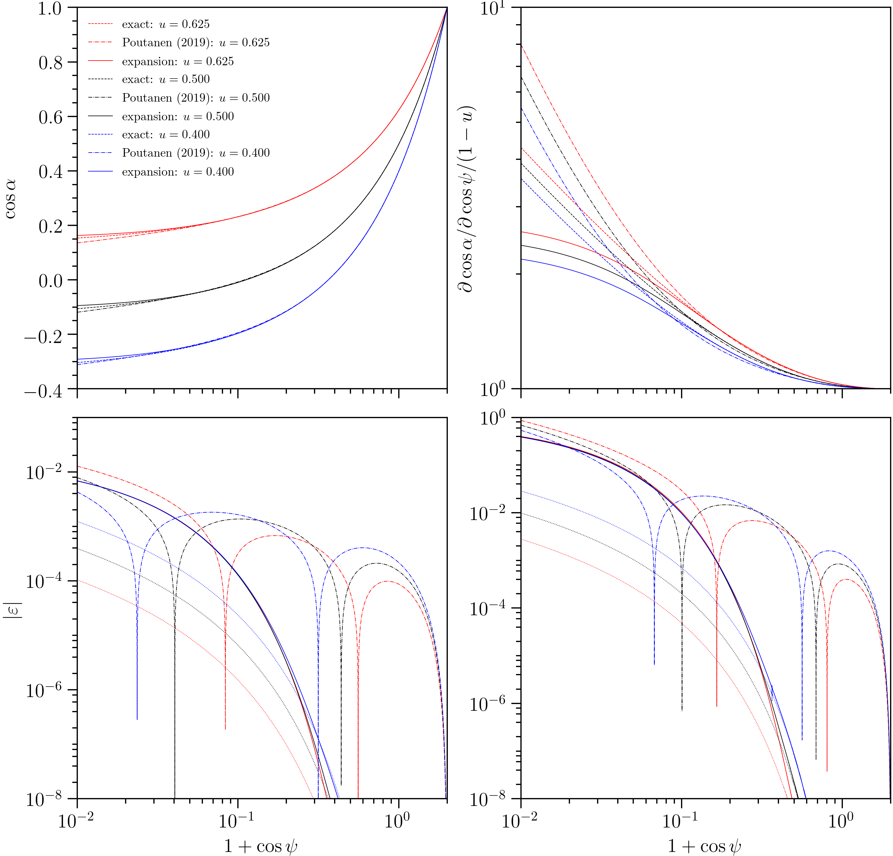
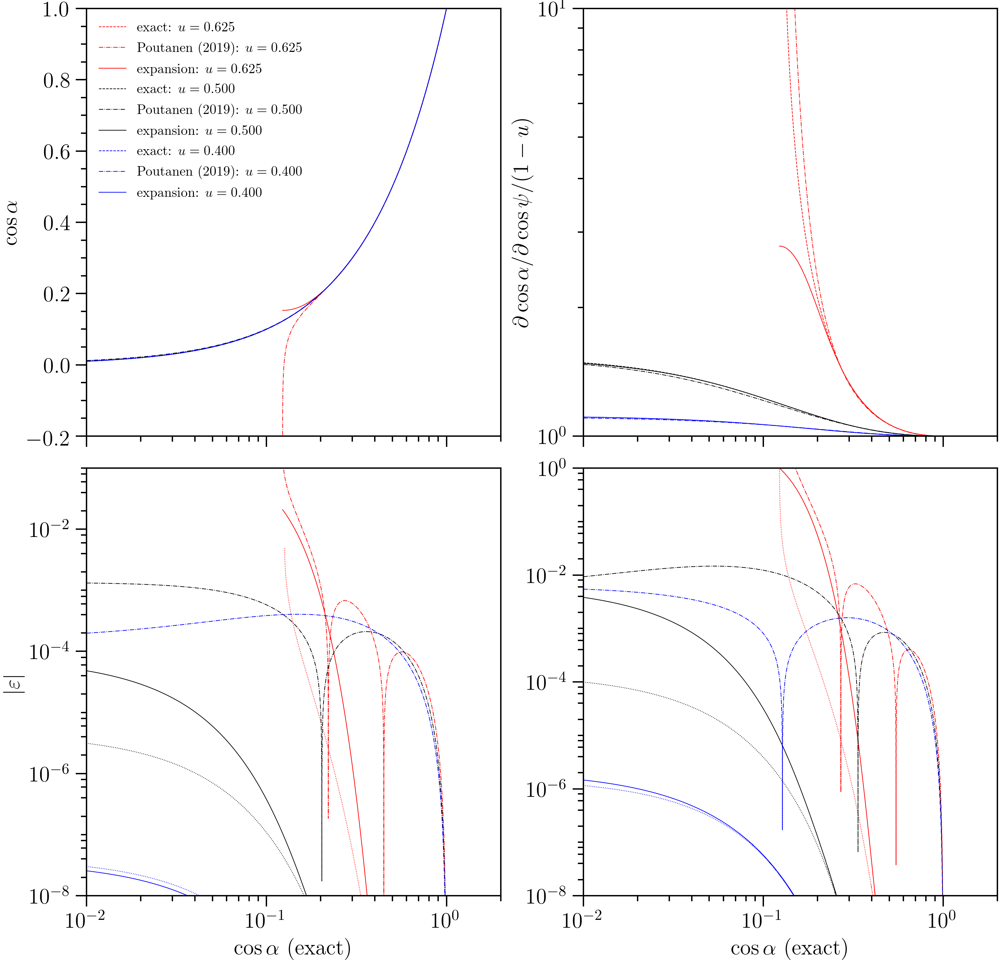

.. _theory:

Theory
======

Ray expansion
-------------

The geodesic (ray) property of interest is the coordinate deflection integral
with respect to the radial coordinate

.. math::

    \psi(\alpha,R) = b\mathop{\int}_{R}^{\infty}\frac{dr}{r^{2}}\left[1 - \frac{b^{2}}{r^{2}}\left(1-\frac{r_{s}}{r}\right)\right]^{-1/2},

where: :math:`R` is the radial coordinate at some spacetime event along the ray;
:math:`r_{s}` is the Schwarzschild radius; and the impact parameter,
:math:`b=b(\alpha,R)`, is affine-invariant. The impact parameter is

.. math::

    b(\alpha, R) = \frac{R\sin\alpha}{\sqrt{1-\frac{r_{s}}{R}}},

where :math:`\alpha` is the angle subtended by the ray tangent four-vector to
the radial direction with respect to the orthonormal tetrad of a local
Eulerian frame. We are only interested in angles :math:`\alpha\leq\pi/2` for
the purpose of approximation design.

The deflection integral has no known closed-form solution. Exact solutions
are approached via numerical quadrature with a variable transformation
to make the integral domain compact and remove the integrand divergence as
:math:`r\to r_{c}^{+}`, where :math:`r_{c}>3r_{s}/2` is the turning point
:math:`dr/d\lambda=0` of a scattering ray, and is :math:`r_{c}=r_{c}(b)`.\ [#]_

However, `Beloborodov (2002)`_ showed that if one lets :math:`y=1-\cos\psi` and
:math:`x=1-\cos\alpha`, then the :math:`\mathcal{O}(x^{2})` term of the
series expansion :math:`y(x;u)` *vanishes*, leading to a useful linear relation

.. _`Beloborodov (2002)`: https://ui.adsabs.harvard.edu/abs/2002ApJ...566L..85B/abstract

.. math::

    y(x;u) = \frac{x}{1-u}+\mathcal{O}(x^{3}),

where :math:`u\mathrel{:=}r_{s}/R`. Note that integrand factor that is
expanded, :math:`x` appears via :math:`\sin\alpha`: although :math:`x\in[0,2]`,
the combination :math:`\sin\alpha=\sqrt{x(2-x)}\in[0,1]`, and the expansion
with respect to :math:`x` is possible due to the *small* function of :math:`x`.
Also note that due to consideration of :math:`\cos\psi`, the exact function
:math:`y(x;u)`, for domain :math:`x\in[0,2]`, is non-injective. The extrema
in :math:`y(x;u)` denote transitions, with increasing :math:`x`, to subdomains
that add\ [#]_ an image---i.e., another ray bundle connecting neighbourhoods of
two points in space with principal angular separation :math:`\psi\in[0,\pi]`.
The integral given above is valid for :math:`\alpha\leq\pi/2`, but the
Beloborodov (2002) series truncation is valid for the set
:math:`\{x\colon\;y(x)\leq2\}`.
The smoothness of the exact relation :math:`y(x;u)`, for fixed :math:`u`, as
across the transition :math:`\alpha=\pi/2` means that a series expansion
with some sufficiently small truncation error for :math:`\alpha\to\pi/2^{-}`
can form an adequate approximation for :math:`\alpha>\pi/2`, for which the
exact function is given by

.. _equation:
.. math::
    \begin{aligned}
    \psi(\alpha,R) &= 2b\Theta\left(\alpha - \frac{\pi}{2}\right)\mathop{\int}_{r_{c}}^{\infty}\frac{dr}{r^{2}}\left[1 - \frac{b^{2}}{r^{2}}\left(1-\frac{r_{s}}{r}\right)\right]^{-1/2}\\
                     &\qquad + (-1)^{\Theta\left(\alpha - \frac{\pi}{2}\right)}b\mathop{\int}_{R}^{\infty}\frac{dr}{r^{2}}\left[1 - \frac{b^{2}}{r^{2}}\left(1-\frac{r_{s}}{r}\right)\right]^{-1/2},
    \end{aligned}

where :math:`\Theta(\ldots)` denotes the Heaviside function.

However, series truncation results in a lack of curvature, and for a subset of
the nominal domain :math:`\alpha\in[0,\pi/2]`, values :math:`y>2`, which
invalidates the definition :math:`y=1-\cos\psi`. The approximation is valid
only for *primary images*, defined by deflections :math:`\psi<\pi`, and the
truncation error grows as :math:`\psi\to\pi^{-}`.

In the context of many astrophysical
problems in which the Schwarzschild solution is applicable, a model
defines the spatio-temporal structure of radiating material in the
near-vicinity of a compact object; the computational domain is then, by virtue
of the symmetries of the Schwarzschild solution, discretised for integration
over the high-energy image subtended by the system on the sky of a distant
observer. The simulator then knows the coordinates of points from whose
neighbourhoods radiation originates, and thus knows the coordinate angular
separation :math:`\psi` between each point and the distant observer, in a
coordinate chart with polar axis defined as coincident with the direction
from the observer to the origin of any Schwarzschild chart. Due to symmetry,
the tangent three-vector to the ray at any spacetime event along it is coplanar
with the tangent three-vector at any other point along the ray.

It follows that for integration over the image of the radiating system, a
relation

.. math::

    x(y;u) = (1-u)y+\mathcal{O}(y^{3})

is desired, together with the convergence of ray bundles, which is encoded
in the derivative

.. math::

    (1-u)\mathcal{D}= \frac{\partial\cos\alpha}{\partial\cos\psi}
                    = \frac{\partial x}{\partial y}
                    = 1-u + \mathcal{O}(y^{2});

the derivative in the Beloborodov (2002) approximation is constant and
performs poorly in effectively all contexts. Hereafter we simply call this
derivative :math:`\mathcal{D}` *the convergence*.

These truncated series have the desirable property that they
are entirely inexpensive to evaluate and do not require numerical
integration nor interpolation. However, more recents studies have attempted
to improve these analytic expressions, with the justification being that
the truncation error is undesirably large in many applications. These efforts
are summarised by `Poutanen (2019)`_, who offers an new :math:`x(y;u)`
relation---that we will label :math:`x_{P19}(y;u)`---that uses the expansion
reported by Beloborov (2002), truncated at :math:`\mathcal{O}(x^{4})`, and
extends it with a logarithmic term to increase the curvature of the
:math:`x_{P19}(y;u)` relation in the near-vicinity of :math:`y\to2^{-}`.

.. _`Poutanen (2019)`: https://ui.adsabs.harvard.edu/abs/2019arXiv190905732P/abstract

The intention of ``rayXpanda`` is to push the notion of series expansion to
a practical limit, and provide functions that can be compiled and executed
somewhat inexpensively. The :math:`x_{P19}(y;u)` relation is fast, argued to be
sufficiently accurate in the majority of statistical contexts involving primary
images and (real or simulated) observations, and simple to duplicate. However,
``rayXpanda``  is motivated by the pursuit of an accurate implementation that
does not depend on numerical quadrature, integration, or interpolation, and
does not add any phenomenological terms that are not generated by the integral
equation under expansion in a small parameter. By doing so, ``rayXpanda``
achieves superior accuracy over *most* of the domain of interest, at
slightly higher computational expense. The orthogonality however, means that
``rayXpanda`` can at the least be used as an independent check of exact
implementations that call numerical integrators and interpolators.

To achieve this aim, the extension modules supplied by ``rayXpanda`` were
generated as follows. First we pursued the higher-order expansion terms given
by Beloborodov (2002) and verified them. We then proceeded symbolically\ [#]_
to generate terms up to :math:`\mathcal{O}(x^{31})`. The resulting polynomial
in :math:`x` has clear pattern in the structure of the coefficients, which are
themselves polynomials in :math:`u`, where the order scales with the
power of :math:`x`. For example, truncating at :math:`\mathcal{O}(x^{8})`
yields

.. math::
    \begin{aligned}
    \frac{y(x;u)}{u^{2}} = \frac{z}{u^{2}} &- \frac{z^{3}}{112}\\
               &+\frac{z^{4}(3u - 5)}{672}\\
               &-\frac{z^{5}(2673u^2 - 8008u + 6461)}{1345344}\\
               &+\frac{z^{6}(9372u^3 - 39347u^2 + 57876u - 30324)}{10762752}\\
               &-\frac{z^{7}(3995442u^4 - 21328659u^3 + 44260348u^2-\ldots)}{10429106688}\\
               &+\mathcal{O}(x^{8}),
    \end{aligned}

where :math:`z\mathrel{:=}x/(1-u)`.

The polynomial in :math:`x` requires almost :math:`10^{3}` floating
point operations to evaluate. We generated the Cython :mod:`~.deflection`
extension module using a Python script, organising the evaluation in a
nested\ [#]_ Horner scheme; we did not make any attempt to optimise the
evaluation beyond this. Furthermore, we obtain the polynomial *partial
derivative* :math:`\partial y/\partial x` simultaneously for the
(inverse) convergence, making the overall scheme efficient.

To generate the Cython :mod:`~.inversion` extension module, it was necessary
to reverse the polynomial to obtain a polynomial for :math:`x(y;u)`. Series
reversion requires a larger number of terms in powers of :math:`y` to recover
the accuracy of the :math:`y(x;u)` polynomial truncated at
:math:`\mathcal{O}(x^{31})`. We push the computation to
:math:`\mathcal{O}(y^{61})`.

Both extension modules are statically typed at ``double`` precision: the
coefficients of the polynomials in :math:`u` are truncated at this precision
but are represented symbolically as a ratio of very large integers that
require many more bits to represent. The function that we automatically
generated for the reversed series :math:`x(y;u)` is :math:`\sim\!1700` lines
long, with an average of a little less than two floating point operations per
line. Very roughly, on a GHz processor, this amounts to
:math:`\mathcal{O}(10^{3})` ns execution time.

Performance
-----------

We now compare the truncation error to that exhibited by :math:`x_{P19}(y;u)`.
We call routines from the xpsi_ package to compute the ray properties via
numerical quadrature.

.. _xpsi: https://github.com/ThomasEdwardRiley/xpsi

    Truncation error comparison.
    The behaviour and error exhibited by
    :func:`~.inversion.invert` is delineated by the **solid** lines. The error
    exhibited by the :func:`~.deflection.deflect` is delineated by the **dotted**
    lines in the lower panels.
    The behavior and error of the :math:`x_{P19}(y;u)` relation is delineated
    by the **dash-dot** lines. The exact relations are delineated in the top
    panels by the **dashed** lines. The error :math:`|\varepsilon|` is the
    fractional error.

The fractional error :math:`\varepsilon` is defined according to the relation
whose truncation error we are interested in. The exact ray properties
computed via numerical quadrature were generated for an
array of :math:`\cos\alpha` values, yielding deflections. For approximative
*inverse* relations such as :math:`x_{P19}(y;u)`, we calculate
:math:`\tilde{\alpha}` given those exact deflections, and define
:math:`\varepsilon=|\alpha - \tilde{\alpha}|/\alpha`. For the
:func:`~.deflection.deflect` module we compute :math:`\tilde{\psi}` and define
:math:`\varepsilon=|\psi - \tilde{\psi}|/\psi`.

However, for the derivative :math:`\mathcal{D}`, the error is
:math:`\varepsilon=|\mathcal{D} - \tilde{\mathcal{D}}|/\mathcal{D}`. The
``rayXpanda`` error curves---one for :func:`~.deflection.deflect`, and one
for :func:`~.inversion.invert`---pertaining to :math:`\mathcal{D}` thus
visibly converge with increasing :math:`\cos\alpha`.

The addition of the logarithmic term by Poutanen (2019) has the effect
that in the limit :math:`y\to2^{-}`, :math:`x_{P19}\to\infty`, forcing
the relation :math:`x_{P19}(y;u)` to cross the exact relation. The
convergence also diverges. The ``rayXpanda`` relation is more accurate in this
limit, and for most of the deflection domain :math:`\cos\psi\in[-1,1]`.
However, the :math:`x_{P19}(y;u)` performs better for
:math:`\cos\psi\lesssim-0.9`, until the :math:`\cos\psi\to-1` limit. The
accuracy of ``rayXpanda`` relative to :math:`x_{P19}(y;u)` is a function of
:math:`u`.

    Truncation error comparison, for a spherical star.
    The behaviour and error exhibited by
    :func:`~.inversion.invert` is delineated by the **solid** lines. The error
    exhibited by the :func:`~.deflection.deflect` is delineated by the **dotted**
    lines in the lower panels.
    The behavior and error of the :math:`x_{P19}(y;u)` relation is delineated
    by the **dash-dot** lines. The exact relations are delineated in the top
    panels by the **dashed** lines. The error :math:`|\varepsilon|` is the
    fractional error.

For a spherical star, ``rayXpanda`` is effectively always more accurate (still
considering primary images only) apart from where the :math:`x_{P19}(y;u)`
relation cross the exact relation. The accuracies become very comparable
for more compact stars when :math:`\cos\psi\to-1` for :math:`\cos\alpha>0`.

An important consideration when benchmarking performance is evaluation time.
A call from a compiled program to a compiled function :math:`x_{P19}(y;u)`
is estimated to require :math:`\mathcal{O}(10^{1})` ns. A call to the compiled
shared objects of ``rayXpanda`` is estimated to require
:math:`\mathcal{O}(10^{3})` ns. However, if one is calling such functions via
a Python extension module, the overhead dominates the processor time to
evaluated :math:`x_{P19}(y;u)`, resulting in an evaluation time of
:math:`\mathcal{O}(10^{3})` ns. Therefore, when called from a Python program,
the expense is almost commensurate per ray. Ideally, however, one would make
far fewer calls through the Python/C API than ray evaluations---for instance,
by using vectorised functions such as :func:`~.deflection.deflect_vec`
and :func:`~.inversion.invert_vec`. A loop over rays in an extension is
likely context, and in this case ``rayXpanda`` is more expensive than
a low-level implementation of :math:`x_{P19}(y;u)`.

Future development
------------------

The current version of ``rayXpanda`` only treats the ray deflection as a
function of the local ray angle (including the derivative for the convergence
property). Possible extensions include treatment of the lag---relative to a
radial ray---via an expansion. However, for various applications such as
neutron star pulse-profile modelling, the gravitational delay makes a much
smaller contribution to signal calculation, and the importance decays with spin
frequency.

One could also devise an improvement for rays characterised by
:math:`\cos\alpha<0`. The integral equation_ given above involving
Heaviside function is suggestive of the same expansion being applicable.
However, *one* difficulty is additional dependence on :math:`\cos\alpha`
because the lower limit of the integral is :math:`r_{c}(b)` instead of
:math:`R`.

``rayXpanda`` also only considers primary images, and it remains unclear if
there is any viable expansion approach to approximate the properties of
higher-order images.

Finally, an obvious way to improve accuracy is to push the expansion and
reversion orders higher, whilst paying attention to precision loss due to
number representation and operation inadequacies, and to the total number of
floating point operations.

.. rubric:: Footnotes

.. [#] In units of the gravitational radius: :math:`r_{c}(b)=\frac{2b}{\sqrt{3}}\cos\left[\frac{1}{3}\tan^{-1}\sqrt{\frac{b^{2}}{27} - 1} - \frac{\pi}{3}\right]`, where :math:`b` is also in units of the gravitational radius.

.. [#] In the absence of opaque surfaces that obscure images, as is the case
       for a neutron star.

.. [#] We applied sympy_, both for series expansion and reversion, and
       integration.

.. [#] Meaning that the coefficients of the polynomial in :math:`x`, which
       are polynomials themselves in :math:`u` are also evaluated using a
       single-variable Horner scheme. Subsequent coefficient evaluations are
       interleaved with the topmost Horner scheme that organises the evaluation
       with respect to :math:`x`.

.. _sympy: https://docs.sympy.org/latest
